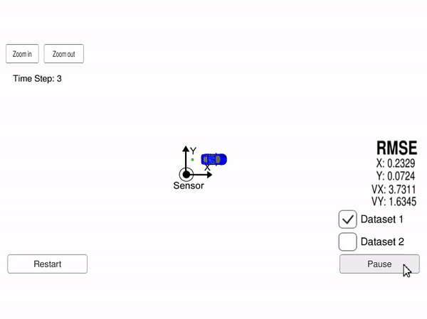
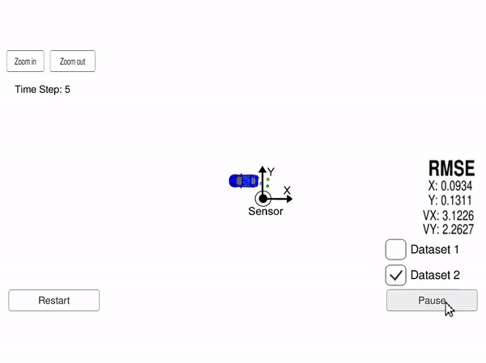

# Self-Driving Car Engineer Nanodegree Program

In this project I utilized a kalman filter to estimate the state of a moving object of interest with noisy lidar and radar measurements. The computed RMSE values of both dataset1 and dataset2 are lower than the tolerance outlined in the project rubric.

### Results

I complete this project by the fulfillment of following functions:

```
1.FusionEKF()          @src/FusionEKF.cpp;
2.ProcessMeasurement() @src/FusionEKF.cpp;
3.Predict()            @src/Kalman_filter.cpp
4.Update()             @src/Kalman_filter.cpp
5.UpdateEKF()          @src/Kalman_filter.cpp
6.CalculateRMSE()      @src/tools.cpp
7.CalculateJacobian()  @src/tools.cpp
```

Follows are the tracking results of dataset1 and dataset2.




### Running the Program

This project involves the Term 2 Simulator which can be downloaded [here](https://github.com/udacity/self-driving-car-sim/releases). After downloading, open the simulator and select `Project 1/2 EKF and UKF` in the main menu screen.

This repository includes two files that can be used to set up and install [uWebSocketIO](https://github.com/uWebSockets/uWebSockets) for either Linux or Mac systems. For windows you can use either Docker, VMware, or even [Windows 10 Bash on Ubuntu](https://www.howtogeek.com/249966/how-to-install-and-use-the-linux-bash-shell-on-windows-10/) to install uWebSocketIO. Please see the uWebSocketIO Starter Guide page in the classroom within the EKF Project lesson for the required version and installation scripts.

Once the install for uWebSocketIO is complete, the main program can be built and run by doing the following from the project top directory.

```
1. mkdir build
2. cd build
3. cmake ..
4. make
5. ./ExtendedKF
```

### Other Important Dependencies

* cmake >= 3.5
  * All OSes: [click here for installation instructions](https://cmake.org/install/)
* make >= 4.1 (Linux, Mac), 3.81 (Windows)
  * Linux: make is installed by default on most Linux distros
  * Mac: [install Xcode command line tools to get make](https://developer.apple.com/xcode/features/)
  * Windows: [Click here for installation instructions](http://gnuwin32.sourceforge.net/packages/make.htm)
* gcc/g++ >= 5.4
  * Linux: gcc / g++ is installed by default on most Linux distros
  * Mac: same deal as make - [install Xcode command line tools](https://developer.apple.com/xcode/features/)
  * Windows: recommend using [MinGW](http://www.mingw.org/)
